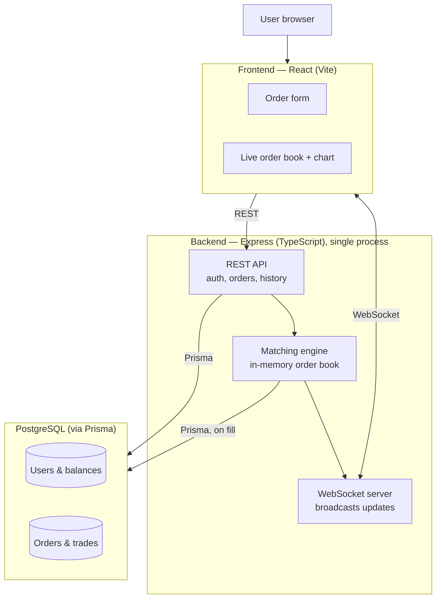
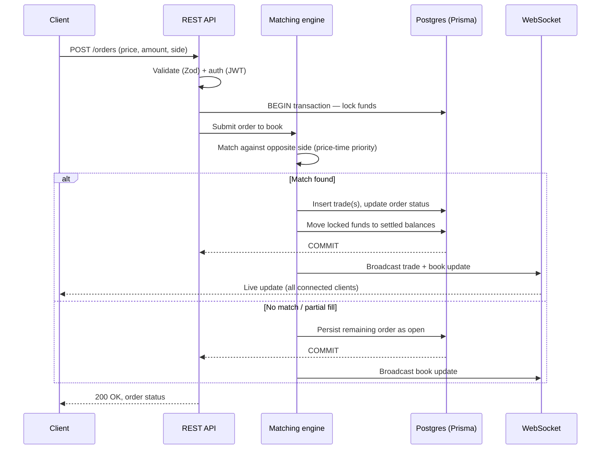
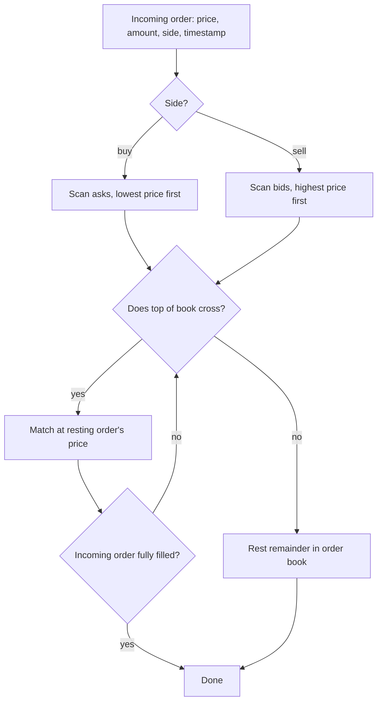
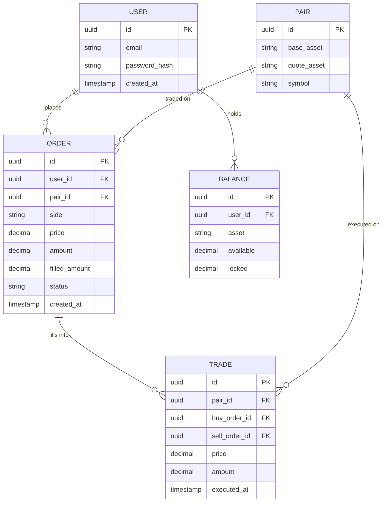

# Crypto exchange simulator — architecture

## Decisions and why

| Decision | Reasoning |
|---|---|
| React (Vite), not Next.js | This is a logged-in, real-time app — no SEO or server-rendering need. Next's API routes would duplicate Express for no benefit. Vite + React is the simpler, correct tool for a WebSocket-driven client. |
| Express, not NestJS | You already know Express. NestJS adds structure you don't need at this size. |
| One backend process, no separate matching-engine service | Splitting into services only solves a problem that shows up when you run multiple API instances and need them to agree on one order book. You're running one instance. Splitting now adds network calls where function calls work, with no payoff. |
| No Redis | Redis earns its place for pub/sub across multiple backend instances, or when the order book must be shared state across processes. You have one process holding the book in memory — that's faster than Redis, not slower. |
| No MongoDB | Trade/order/balance data needs ACID guarantees (money). Postgres is correct for all of it. Adding Mongo "to show you know it" isn't a technical reason. |
| No Turborepo | Turborepo pays off with multiple apps/packages sharing code and needing cached parallel builds. You have one frontend, one backend. A plain two-folder repo is simpler and easier to reason about. |
| PostgreSQL + Prisma | Non-negotiable — orders, trades, and balances need transactional consistency. |

**Scaling path (write this in your README, don't build it now):** if this needed multiple backend instances, the next step would be extracting the matching engine into its own process and coordinating book state via Redis pub/sub. Understanding *when* to introduce that is the actual skill; building it unearned isn't.

## Tech stack

| Layer | Technology |
|---|---|
| Frontend | React (Vite) + TypeScript, Zustand for state, `lightweight-charts` for price chart, `socket.io-client` |
| Backend | Express + TypeScript, Zod for validation, JWT for auth, `socket.io` server |
| Matching engine | Plain TypeScript module inside the backend process — in-memory sorted order book |
| Database | PostgreSQL + Prisma |
| Deployment | Docker for local Postgres, hosted on Railway/Render/Fly.io |

## High-level architecture

## Order lifecycle (sequence)

This is the path a single order takes from submission to settlement — the part that actually needs to be correct.

**Why the DB transaction wraps fund-locking and the match together:** if the process crashes mid-match, you cannot end up with funds locked but no corresponding order in the book, or a trade recorded without balances updated. This is the part that separates a toy from something that behaves like real money infrastructure — not which services you deployed.

## Matching engine internals

Key rules to encode as unit tests before touching HTTP:
- **Price-time priority** — best price matches first; ties break on earliest timestamp.
- **Trade executes at the resting order's price**, not the incoming order's price (this is where "price improvement" comes from).
- **Partial fills split across multiple counterparties** — one incoming order can consume several resting orders in sequence.
- **Unmatched remainder rests in the book** on the correct side.

Test this against the multi-buyer/multi-seller scenarios worked out earlier (sequential arrivals vs. simultaneous arrivals) — those are your actual test cases.

## Database schema

`available` and `locked` on `BALANCE` are separate columns deliberately — placing an order moves funds from `available` to `locked`, a fill moves `locked` to gone (transferred), a cancel moves `locked` back to `available`. Never let these be a single mutable number you decrement in place; you want an audit trail of *why* a balance changed.

## Build order

1. **Prisma schema** — the tables above, exact types, before writing any logic.
2. **Matching engine, isolated** — no Express, no DB. Hardcode order scenarios, verify against hand-worked examples.
3. **Wrap in REST** — `POST /orders`, `DELETE /orders/:id`, `GET /orders`, wired to Prisma transactions.
4. **WebSocket broadcasting** — emit on every match and book change. Test with `wscat` before touching the frontend.
5. **Frontend order form** — REST only.
6. **Frontend live book/chart** — WebSocket subscription.
7. **Auth + balance locking** — last, once the trading mechanics are proven correct.

## What makes this "production-grade" (not service count)

- Money-moving operations wrapped in Postgres transactions — no partial state on crash.
- Input validation (Zod) and auth (JWT) on every mutating route.
- Idempotency on order placement — a retried request shouldn't double-place an order.
- Rate limiting — someone shouldn't be able to spam the matching engine.
- Structured logging, no leaked stack traces in error responses.
- Unit tests on the matching engine specifically — this is the part you'd walk an interviewer through.
- Dockerized Postgres locally, real deployment (Railway/Render/Fly.io) so it's a working URL, not just a repo.